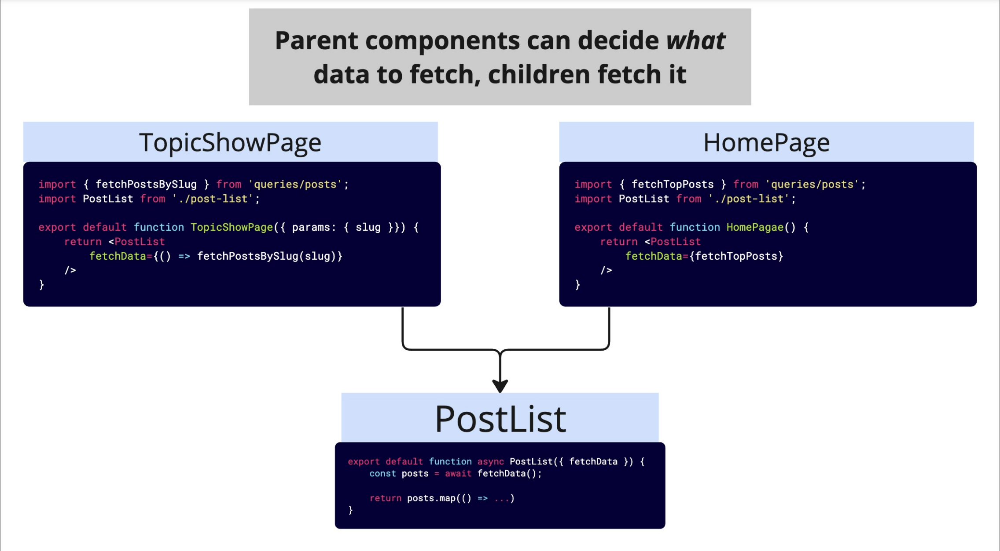

Nuevo proyecto de especie de reddit. Con Autorizacion next-auth, NextUI, Prisma y una db SQlite.

**_ Diseño del Proyecto: _**

Es siempre importante pensar desde antes cómo diseñar el proyecto.
Resolver desafíos de caché UPFRONT:
~ Identificar los diferentes tipos de data que van a cambiar en la app.
~ Encontrar los diferentes lugares donde esta data puede cambiar.

1. Instalar nextui y creción de un Provider que envuelve a la aplicación con NextUiProvider agregando el provider a layout.tsx

2. Creacion de prisma db npx prisma init --datasource-provider sqlit y de schema.prisma con los modelos necesarios para usar PrismaAdapter

3. Configuracion de next-auth y github OAuth
   ~ Es necesaria crear una aplicacion OAuth en el sitio web de Github.
   ~ Definir variables dentro .env.local con el secret y el github id.
   ~ instalar paquetes, se usan estas versiones que sabemos que funcionan así
   @auth/core@0.18.1 @auth/prisma-adapter@1.0.6 next-auth@5.0.0-beta.3

4. app/api/auth/[...nextauth]/ route.ts
   ~ Implementan manejadores de solicitudes de API (GET POST UPDATE) dentro de la app
   ~ Los servidores de Github van a intentar llegar a nuestra aplicación para gestionar la autenticacion

5. Auth con Server Actions
   Manejamos las funciones de next auth como server actions para tener un mejor control y organizacion del proyecto.

**Initial Design**
 6. Identificar todas las rutas que nuestra aplicación va a tener y como va a funcionar la data 7. Creación de PATH HELPERS.

8. Creación de carpetas y pages.tsx de las rutas y pensar qué actions van a suceder por archivo.

9. Separación de actions por archivo.

10. Al correr npm run build vemos si las rutas son statics o dynamics. Si queremos saber si un archivo es dynamico:
    
    Buscamos tener paginas statics que carguen más rapidamente.
    En el caso del Header, al hacer llamar desde el componente del servidor el estado de autentificacion con un useAuth(), haciendo cambios en las cookies, se convertía en una pagina dinamica el Home (desde donde se llama). En cambio, si cambiamos dentro del header esa parte y lo llevamos a un client component donde se resuelva el estado de la autentificacion con un useSession(), el Home pasa a ser static.

**FORM VALIDATIONS IN SERVER ACTIONS. W USESFORMTATE AND ZOD** 11. Las validaciones de los form van a estar en los SERVER ACTIONS 12. Con ZOD se crean schemas para hacer las validaciones de lo sformularios 13. useFormState para devolver esos errores

**Fetch data in parent component or in child component** 14. Hacer el fetch de la data en el componente padre o en el componente hijo? Se puede resolver especificando qué datos queremos obtener dentro de nuestros padres, pero luego realmente ejecutar la query en el componente hijo. Entonces, el componente padre decide qué data fetchear y el componente hijo lo hace.

**NO HACER PETICIONES QUERY DUPLICADAS A BD**
11. Solución para no hacer un montón de peticiones duplicadas a la base de datos: 
 ~Request Memoization Cache: Las solicitudes a la base de datos que sean iguales se guardan en caché para no repetirse.
 En esta aplicación , la funcion fetchCommentsByPostId se ejecutaba varias veces demás. Al memoizarla la funcion con el mismo postId se ejecuta una sola vez: export const fetchCommentsByPostId = cache((postId)=>...) . Mientras el argumento sea identico, no se duplicaran las llamadas. En otras palabras, la función real sólo se va a ejecutar una sola vez, y luego el resultado de esa llamada será enviado de vuelta a todos nuestros diferentes componentes que llamaron a buscar comentarios por postId.

 12. Componente SUSPENSE de react: permite mostrar el contenido del padre mientras los hijos estan obteniendo datos lo que hace facil de implementar loading spinners.